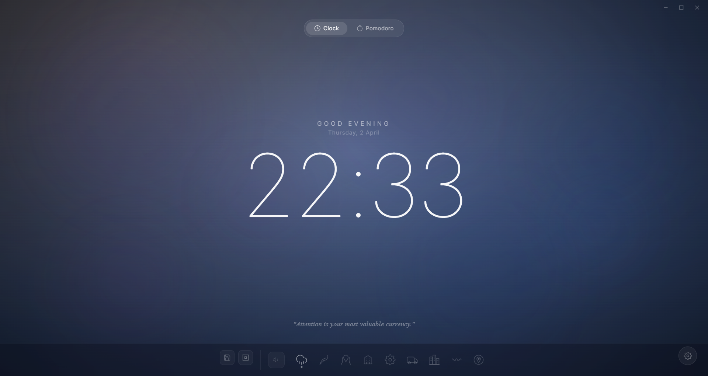

# Prosoche

Pomodoro timer with ambient sounds for focused work.

## Preview



## Highlights

- Elegant clock + Pomodoro focus modes in one minimal interface.
- Includes 89 ambient sound tracks across multiple categories.
- Mix multiple sounds with independent volume control.
- Turkish / English language support.

## Installer

- Current version: `1.0.1`
- Setup and Portable EXE are published in GitHub Releases.
- Build command:
```bash
npm run dist
npm run dist:portable
```

## Run (Development)

```bash
npm install
npm start
```

Optional check:

```bash
npm run check
```

## Privacy

Prosoche stores settings and scenes locally on your device and does not send personal data to cloud services.

## License

MIT
